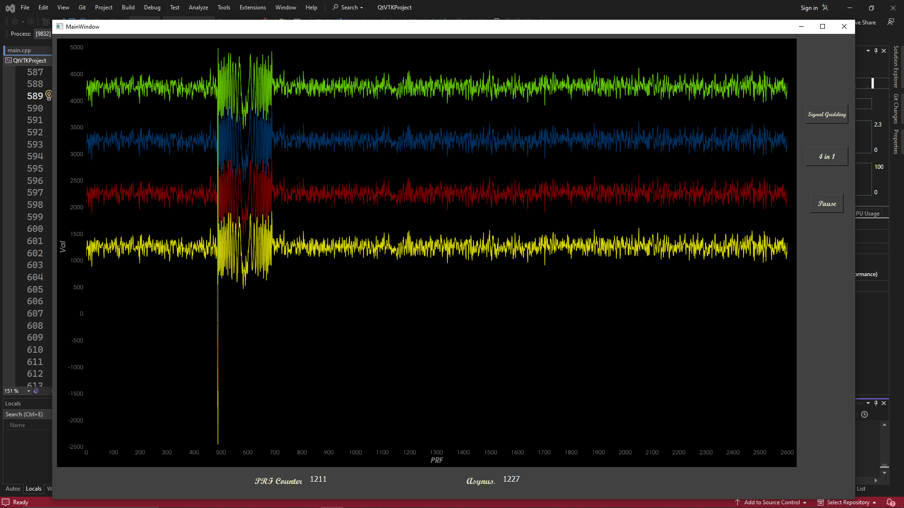

# RealTime Chart Plot with VTK & Qt
2D and 3D Rendering with VTK (the Visualization Toolkit) and providing several classes for creating real-time plots, including vtkChartXY, vtkPlot, and vtkTable.

# Video of test:

# Griding plots:

# 4 Plots in one view:

